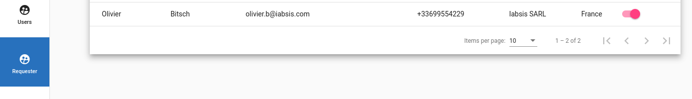
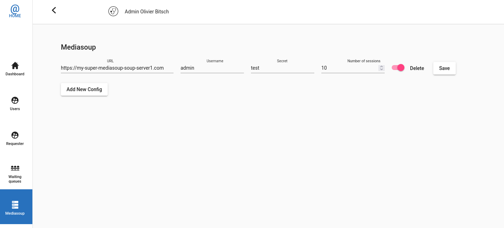

# Admin interface

Admin interface permits to a site administrator to check user roles, approve Requester account done by Partners, manage waiting queues, administrer Mediasoup servers and get anonymised statistics.

# Users administration

Open **Users** to review all registered users.

> Warning, if auto-create mode is enable with SSO, new users might be created on fly.

Click on the Pen to edit a user information and to assign user to queues.

# Requester administration

Requester administration only permits to toggle the active state of a requester.

Click on **Active** switch box to allow or deny the access to consultation request page.

# Waiting queues

Waiting queues are shared areas across several doctors. Whenever a consultation is requested by a patient or a Partner, all doctor in this queues will see it until somebody handle it.

# Mediasoup servers

HCW@Home can distribute calls over severals Mediasoup servers. When a call is requested, a randon Mediasoup server is taken and users are sent to. The interface permits to do updates or disable server on fly without the need to interupt users or restart server.

