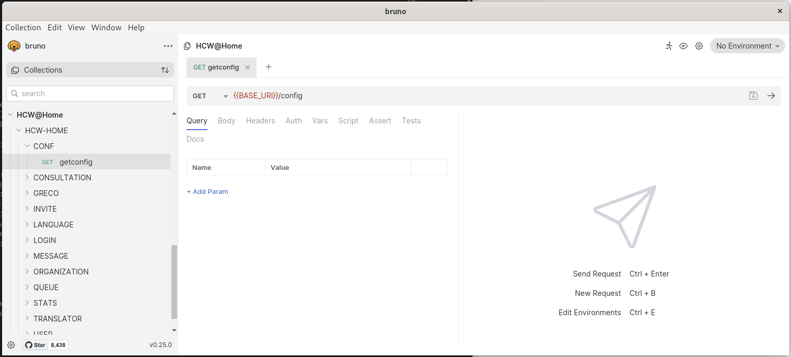

# Debug API with Bruno

Bruno is a Fast and Git-Friendly Opensource API client, aimed at revolutionizing the status quo represented by Postman, Insomnia and similar tools out there.

## Install Bruno

You can easily download and install Bruno on your computer from the official Bruno website. It's also a free and open source software.

> [https://www.usebruno.com/downloads](https://www.usebruno.com/downloads)

The Bruno projects can be opened from the doc/HCW@Home folder from [https://github.com/hcw-home/backend](https://github.com/hcw-home/backend) (HCW@Home Backend) Github project.

- Open Bruno on your computer, then click on Collection menu and Open Collection.
- Browse the folder where you dowloaded the Backend files and browse into `doc/HCW@Home` folder.

## Configure environment

Now you have the Bruno project opened, click on No environment from the top right of the menu and choose Configure. Define the various information related to your project (BASE_URI, EMAIL and PASS). Click on Save.

Now close the modal, and choose your configured environment Development (Admin) from the top right menu.

## Run request

You are now ready to login with HCW@Home\LOGIN\Login local and hen run any requests.