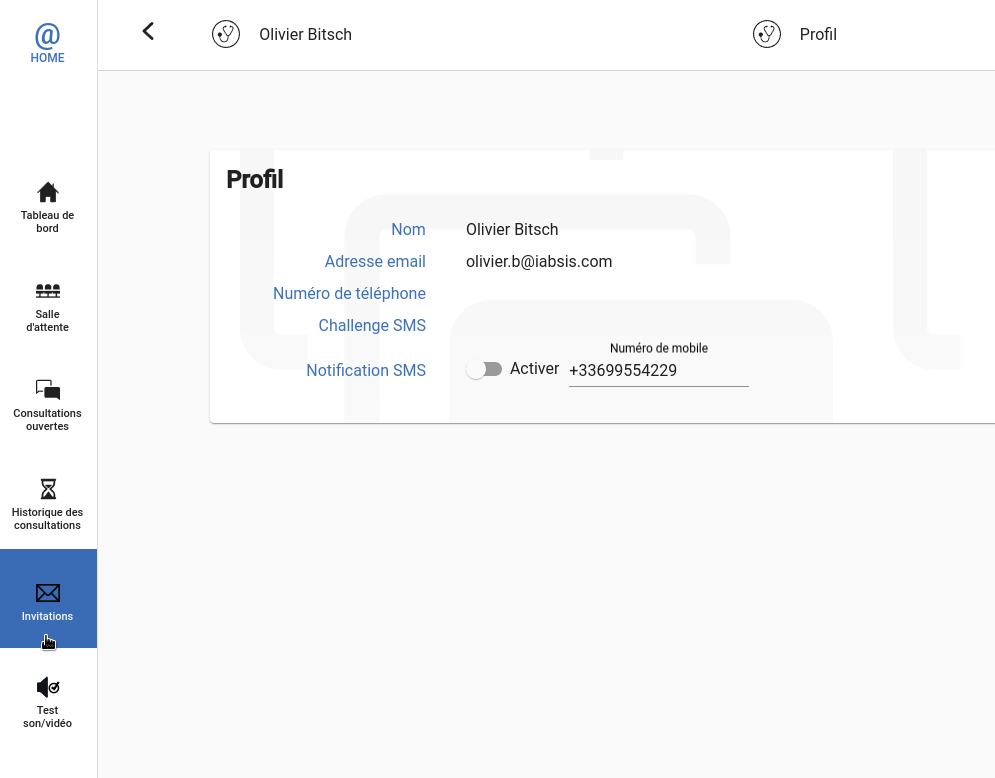
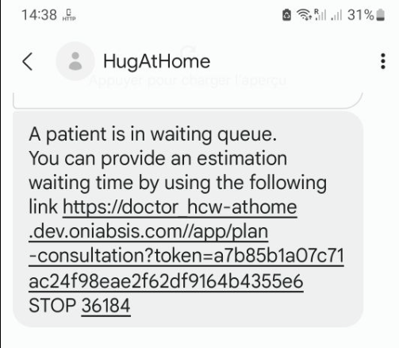

# Configure notification

Whenever a patient comes into the Waiting queue, your browser will notify you with a notification sound. You can visually see that somebody is waiting from **Dashboard** or **Waiting queue** page.

But in the event of you didn't kept your browser opened, you may easily miss that a patient is waiting. In that situation, you can enable HCW@Home SMS notification very easily.

* From any page, click on your name available on top of the screen. This will open a small menu, then click on Profile.
* Beside **SMS notification**, put any mobile phone number when HCW@Home must send the notification.
* Toggle the **Enable** switch to enable the notification.

Now as soon a patient is in waiting queue, you will receive this kind of notification.

# Provide estimated waiting time to patient

When you handle approximate appointement to your patient, or when you use external form so patient can reach Waiting queue any time, it might be usefull to provide estimated waiting time to your patient.

* First, ensure you have enable SMS notification when patient reach the waiting queue.
* Once you received the SMS, click on the link provided.
* You will get a simple page useful to provide estimated time.
* Your patient will receive automatically a message from your with your estimated waiting time.