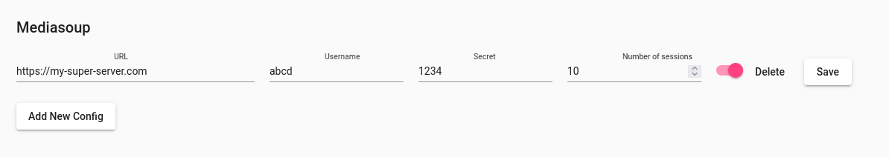

# Debian/Ubuntu installation

## External repository setup

HCW@Home relies on third party repositories as there is no recent version of mongo or nodejs into official repositories.

```
apt install curl gnupg ca-certificates lsb-release

# NodeJS Repository
NAME=nodejs
VERSION=18
KEY_URL="https://deb.nodesource.com/gpgkey/nodesource.gpg.key"
APT_URL="https://deb.nodesource.com/node_${VERSION}.x $(lsb_release -sc) main"
PACKAGE=nodejs

curl -fsSL ${KEY_URL} | gpg -o /etc/apt/trusted.gpg.d/${PACKAGE}.gpg --dearmor
echo "deb [signed-by=/etc/apt/trusted.gpg.d/${PACKAGE}.gpg] ${APT_URL}" > /etc/apt/sources.list.d/${NAME}.list
apt update
apt install ${PACKAGE}

# MongoDB Repository
NAME=mongodb
VERSION=6.0
DIST_NAME=$(lsb_release -si)
COMPONENT=$(if [ ${DIST_NAME} == "Ubuntu" ] ; then echo "multiverse" ; else echo "main" ; fi )
KEY_URL="https://www.mongodb.org/static/pgp/server-${VERSION}.asc"
APT_URL="http://repo.mongodb.org/apt/${DIST_NAME,} $(lsb_release -sc)/mongodb-org/${VERSION} ${COMPONENT}"
PACKAGE=mongodb-org

curl -fsSL ${KEY_URL} | gpg -o /etc/apt/trusted.gpg.d/${PACKAGE}.gpg --dearmor
echo "deb [signed-by=/etc/apt/trusted.gpg.d/${PACKAGE}.gpg] ${APT_URL}" > /etc/apt/sources.list.d/${NAME}.list
apt update
apt install ${PACKAGE}
systemctl enable --now mongod
```

After those commands are done, you should have up and running mongo service.

## Install Redis

Redis is an on memory database, it's used to temporarily store information like a session. Installation of Redis server must be shared between backends (if several ones are deployed), but we are assuming here we are installing on one server. The installation is very simple:

```
apt install redis-server
```

## Install antivirus

Antivirus limits the risk of propogating malware through HCW@Home. It will check any attachments given by a patient or doctor during the consultation. Antivirus can be installed on same server or on an external server.

```
apt install clamav-daemon
```

Check that service is up.

```
systemctl start clamav-daemon
systemctl status clamav-daemon
```

## Install coturn server

Coturn is an open-source project that provides a TURN and STUN server implementation. Both TURN and STUN are protocols that help in NAT traversal for WebRTC applications.

Coturn setup can be achieved in a different mode, we assume that we are installing on the same server as the Backend, but it's strongly recommanded to install on a different server.

```
apt install coturn
```

Now adjust the file /etc/turnserver.conf like this.

```
# Enable only if your server is behind a NAT.
external-ip=<you machine ip>

# Adjust only if you want to use another port.
listening-port=3478

# Ensure to enable fingerprint and long term credential.
fingerprint
lt-cred-mech

# Adjust the port range that turn is allowed to use. The port range must be opened from the
# firewall as UDP and TCP.
max-port=65535
min-port=49152

# Choose a realm, can be formatted like iabsis.com
realm=<domain>

# Configure a user and a password, this is required to be 
# allowed to use the turn relay capabilities. <user>:<password>
user=myuser:mypass
```

If you don't want to put a clear password in the configuration file, you can encode the password with the following command.

```
turnadmin -k -u <user> -r <realm> -p <pass>
```

This command returns an encoded password starting with 0xabc..., replaces mypass by the returned value, ensures to keep 0x in front of the password.

```
user=myuser:0xabc...
```

Keep in mind this user and password configured here as it will be used later by Mediasoup server.

## Install HCW@Home repository and package


HCW@Home is composed of four main components:

- One Backend
- One Frontend dedicated to Doctors
- One Frontend dedicated to Patient
- One Frontend dedicated to Administrators

Those components can be installed on the same server or on a different one. Here we will explain how to install on the same server.

```
cat > /etc/apt/sources.list.d/hcw.list << EOF
deb [arch=amd64 trusted=yes] https://projects.iabsis.com/repository/hcw-backend/debian focal main
deb [arch=amd64 trusted=yes] https://projects.iabsis.com/repository/hcw-patient/debian focal main
deb [arch=amd64 trusted=yes] https://projects.iabsis.com/repository/hcw-doctor/debian focal main
deb [arch=amd64 trusted=yes] https://projects.iabsis.com/repository/hcw-admin/debian focal main
EOF
```

Now, refresh the list of packages with the following command.

```
apt update
```

Finally, you can install the thre component on one command

```
apt install hcw-athome-patient hcw-athome-backend hcw-athome-caregiver hcw-athome-admin
```

## Install and configure web server


Now you have an up and running HCW@Home system, you must install a web server. We tested Nginx web server even if it should work with others like Apache.

Installation of Nginx is straightforward

```
apt install nginx
```

If you don't have a reverse proxy server in front of your Nginx, you might need to install certbot for issuing SSL certificates. You can install the following package

```
apt install python3-certbot-nginx
```

By default, HCW@Home doesn't install Nginx configuration, but you can use the ready configuration from the doc folder. Don't forget to adjust the configuration based on your needs.

```
wget https://raw.githubusercontent.com/HCW-home/frontend-patient/master/nginx-docker.conf.template -O /etc/nginx/sites-enabled/hcw-patient.conf
wget https://raw.githubusercontent.com/HCW-home/frontend-patient/master/nginx-docker.conf.template -O /etc/nginx/sites-enabled/hcw-doctor.conf
wget https://raw.githubusercontent.com/HCW-home/frontend-patient/master/nginx-docker.conf.template -O /etc/nginx/sites-enabled/hcw-admin.conf
rm /etc/nginx/sites-enabled/default
```

Update the files :

```
listen       80;
server_name  <replace by your domain>;
root   /usr/share/hcw-athome/admin; # or patient or caregiver for depending of config file you are updating;
...
proxy_pass http://127.0.0.1:1337; # Update 127.0.0.1 if installed on same server, or different IP if separate sever.
```

The last command removes the fallback default configuration provided by Nginx.

If you now want to issue certificate, run the following command and follow the usual cerbot process. If you need more information about this process, read the official documentation: https://certbot.eff.org/

```
certbot --nginx
```

## Configure HCW@Home

Now that every component is ready, we can update the main configuration file /etc/hcw-athome/hcw-athome.conf. Most of the parts are self explanatory, you are free to adjust according to your specific configuration.

Also adjust the socket or port Clamav can be reached. If you use socket, you might need to first add HCW@Home system user to Clamav group to be able to communicate with the Daemon.

```
adduser hcwhome clamav
```

Check now the socket path, by default it should be /var/run/clamav/clamd.ctl, so you can adjust this path in HCW@home configuration with this command.

```
sed -i 's|/var/run/clamd.scan/clamd.sock|/var/run/clamav/clamd.ctl|g' /etc/hcw-athome/hcw-athome.conf
```

Once updated, you can restart and check for logs with the following commands.

```
systemctl enable --now hcw-athome
or
systemctl restart hcw-athome
```

Check logs

```
journalctl -f -u hcw-athome -n 200
```

If you see the following line, it means your server is ready.

```
Aug 23 13:15:33 hcw-athome-dev node[546330]: debug: -------------------------------------------------------
Aug 23 13:15:33 hcw-athome-dev node[546330]: debug: :: Wed Aug 23 2023 13:15:33 GMT+0000 (Coordinated Universal Time)
Aug 23 13:15:33 hcw-athome-dev node[546330]: debug: Environment : production
Aug 23 13:15:33 hcw-athome-dev node[546330]: debug: Port        : 1337
Aug 23 13:15:33 hcw-athome-dev node[546330]: debug: -------------------------------------------------------
```

## Create first admin account

You must have a least one admin account before being able to login on the admin interface (then being able to create another user). Create the first user with mongo request.

```
mongosh
use hcw-athome;
db.user.insertOne({email:"admin@example.com",  firstName:"Admin", lastName:"",  role: "admin",  createdAt: new Date().getTime(), password: "$2b$10$uip0TKwn.kbO1s1C3jO0au4ymxjkgd.kg9ueH2oV02I4gJBKzH.2m", "updatedAt": new Date().getTime(), "username" : "admin@example.com", phoneNumber: ""})
```

This command will create a user with login "admin@example.com" and password "admin".

If you need to customize this password and you have nodejs installed (or you do on your server), you can use the following script, by example into password.js, don't forget to update 'not hashed password'.

```
const bcrypt = require('bcrypt');

bcrypt.hash('not hashed password', 10, function(err, hash) {
  if(err) console.log(err)
  console.log(hash);
});
```

You will need to install bcrypt with the following command.

```
npm install bcrypt
```

Then run the script with:

```
node password.js
```

## Install Media server with Mediasoup

Mediasoup is a media server used to send flow between participant.

```
cat > /etc/apt/sources.list.d/mediasoup.list << EOF
deb [trusted=yes] https://projects.iabsis.com/repository/mediasoup-api/debian bullseye main
EOF
```

Refresh the list of available package.

```
apt update
```

Now install the package

```
apt install mediasoup-api
```

Now adjust the file /etc/mediasoup-api/mediasoup-api.conf, don't forgot to define the following lines with your coturn configuration previously defined.

```
TURN_SERVER1=turn:turn.example.com/?transport=udp
TURN_USERNAME1=myuser
TURN_PASSWORD1=mypwd
```

Most values are self explanatory, once you've done your changes, restart the service with the following command.

```
systemctl status mediasoup-api
```

If you prefer to serve Mediasoup API with Nginx (recommended), you can create a new Nginx file (by example /etc/nginx/sites-enabled/mediasoup.conf) and use the following template.

```
map $http_upgrade $connection_upgrade {
    default upgrade;
    ''      close;
}

server {
    server_name <domain>;

    location / {
        proxy_set_header Host $host;
        proxy_pass https://localhost:3443;
        proxy_set_header X-Forwarded-For $remote_addr;

        proxy_http_version 1.1;
        proxy_set_header Upgrade $http_upgrade;
        proxy_set_header Connection $connection_upgrade;

        proxy_set_header X-Forwarded-Proto $scheme;
        proxy_set_header X-Forwarded-Port $server_port;

        proxy_connect_timeout 120m;
        proxy_send_timeout 120m;
        proxy_read_timeout 120m;
    }

    listen 80;
}
```

Don't forget to update the <domain> part. If you need to issue certbot certificate, use again the following command.

```
certbot --nginx
```

## Mediasoup declaration in HCW@Home

If you have only one mediasoup server, you can simply configure it into HCW@Home configuration file.

```
#/etc/hcw-athome/hcw-athome.conf
MEDIASOUP_URL=https://<replace-by-my-domain>
MEDIASOUP_USER=abcd
MEDIASOUP_SECRET=1234
```

If you have more than one server, you can add all from admin interface from "Mediasoup" menu.


