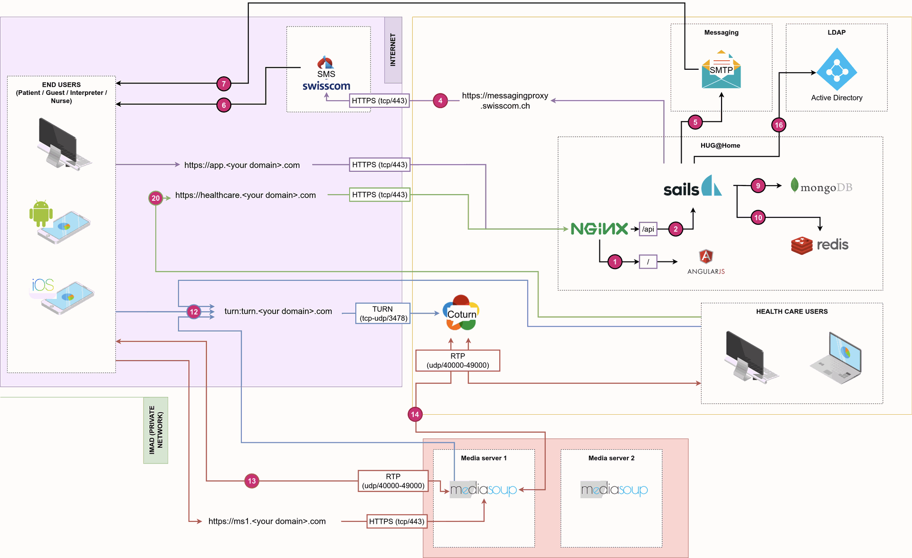

# HCW@Home - Simple & Secure remote consultations

HCW@Home is a complete infrastructure composed of various components. This greatly simplifies the installation without the need to compile the solution. This also ensure smooth upgrades by using the usual package manager.
Operating system requirements

You will require at least one server running a recent version of Debian/Ubuntu. We successfully tested the setup on the following environment:

- Debian 10 and 11
- Ubuntu 20.04, 22.04
- Any linux with Docker support

## Hardware or virtual hardware requirements

The requirement deeply depends of number of concurrency users connected in same time on the platform. The bare minimum is the following:

- 1Gb of RAM (a bit more if clamav is installed on same server)
- 1 vCPU​
- 5Gb of Hard drive free space

## Domain name considerations

The bare minimum domain name required by HCW@Home is three.

- Domain name used by Doctor interface (e.g. `healthcare.<your domain>.com`)
- Domain name used by Patient interface(e.g. `app.<your domain>.com`)
- Optional - Domain name used by Admin interface (e.g. `admin.<your domain>.com`)
- Mediasoup server. (e.g. `ms1.<your domain>.com`)
- Optional: Coturn URL (e.g. `turn.<your domain>.com`)

## Firewall considerations

- It will required to open the following ports for the Frontend and Backend:
    - Port 443 for the webserver (https)
    - Port 80 for the redirect (http)
- It will required to open the following ports for the Mediasoup
    - Port 443 for the webserver (https)
    - Configurable UDP and TCP range, default is 40000 > 49000.
- It will required to open the following ports for the Turn
    - Port 3478 for the service listening.
    - Configurable UDP and TCP range, default is 49152 > 65535.

## Reverse proxy considerations

HCW@Home can perfectly work behind a reverse proxy. You must ensure to have correct support for:

- Enable support of Websocket.
- Don't intercept errors.
- Have the Host, X-Forwarded-Host, X-Forwarded-Port, X-Forwarded-For and X-Forwarded-Proto headers correctly configured.

