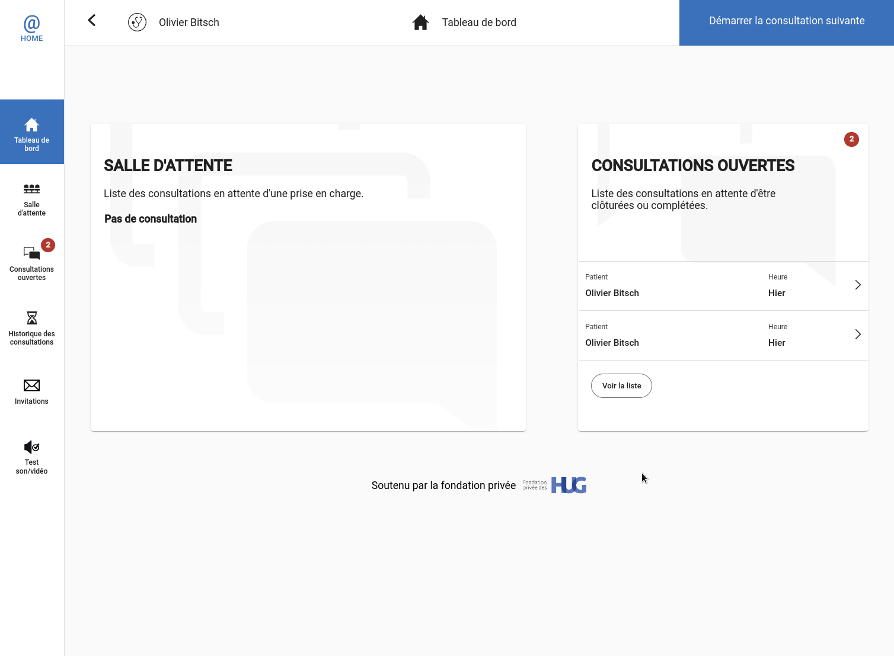
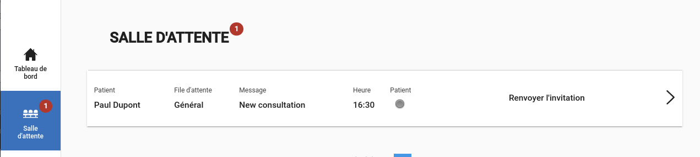
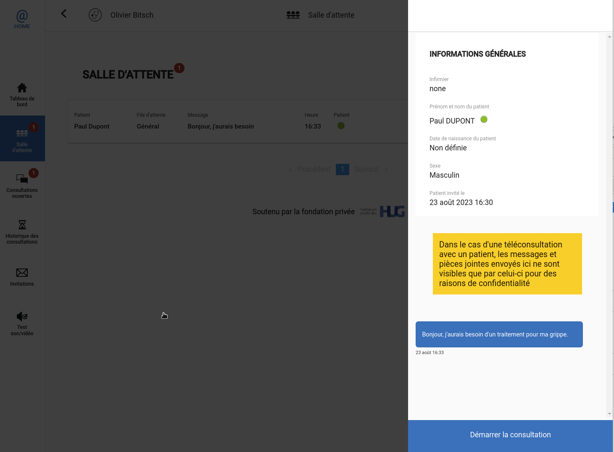
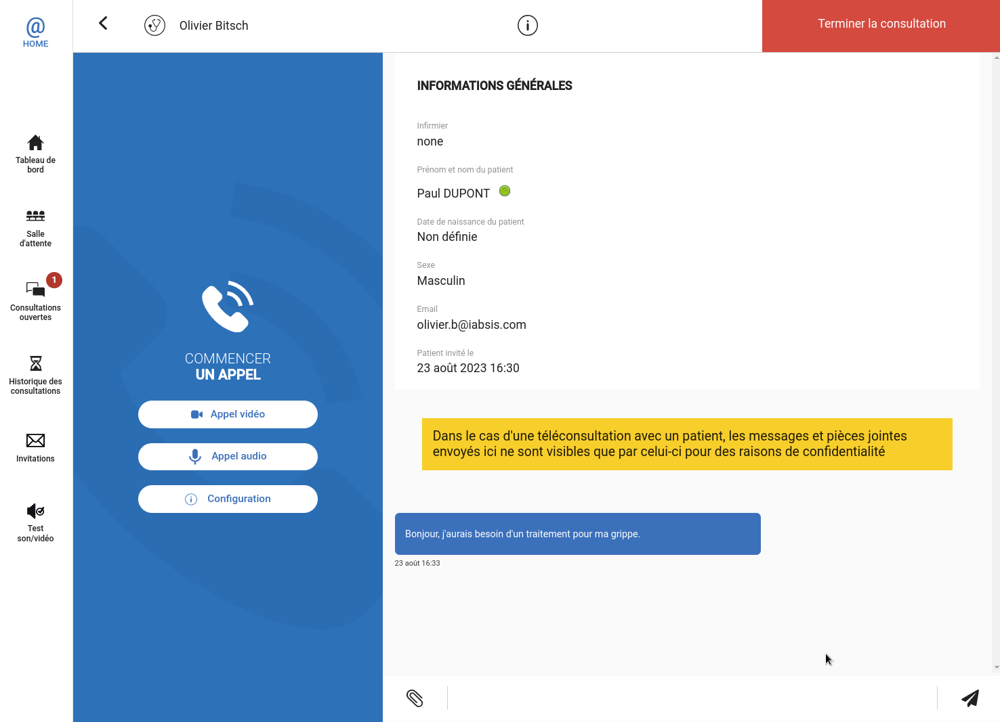

# Login on HCW@Home

HCW@Home exclusively works in a web browser. Open the app with the link of your instance.

It exists several ways to login into HCW@Home depending of how the solution is integrated.

> If you connected on Instance Demo, an SSO is in place, it means the access is handled by external server and requires to login only one time. Because you are already loggued in this website, you will be connected automatically on HCW@Home as well.

The login page may vary but could look like that.

Institutional access mean you will connect with Single Sign On process. You can also login with a simple email and password, concluded by SMS validation (2FA). 

# Dashboard page and menu

Dashboard permits to have a quick view of what is on going. The Waiting queue are patient who joined the consultation, but waiting for healthcare to handle it. Open consultation are consultation started by you.

You can have the full list of **Opened consultation** and **Waiting queue** by clicking on icon available on the left of the app.

Once you achieved a consultation, the consultation goes into **Consultation history**, but remains only 24h before data are completely wiped. We will describe a bit more about the consultation process in next sections.

**Invitations** icon will permit to send invitation to your patient. We also describe this process in next sections.

Finally the **Test sound/video** icon permits to check that Microphone and Webcam is usable correctly.

# Sending invite to a patient

One of the usual way to use HCW@Home is starting by sending invite directly to your patient. To achieve this, click on **Invitations** icon, and click on **New invitation**.

You will be asked to choose if your patient is remote (the usual) or in your office (special case where you want to do video call with third party). Let chose **Patient is remote**. 

Now define your patient **Firstname**, **Lastname**, **Gender** and **Phone number** *or* **Email**. Firstname, Lastname and Sex are only used to ease patient identification when he is in Waiting queue. Phone number or Email will be used to directly send the invite link, by SMS or Email.

You can optionnaly invite a guest with the option available on the right.

# Revoke or resend invite

In the event of you patient didn't received the link, you can resend invite. Click on Invitation from the left menu, find the right invite from the list and click on Resend.

In the event of you want to cancel and rekove the invite, you can click on Delete.

> If you delete an invite, the patient will get an error if he clicks on the link. No notification are sent by HCW@Home to indicates the invite has been cancelled.

# Manage queuing

As soon as a patient uses the invite link, he will be asked to join the consultation. Then the patient will come in Waiting queue, visible from **Dashboard** or **Waiting queue** icon. You will received an audible notification in page page, prefer always keep any HCW@home opened if you expect to have remote consultation.

You can click on the consultation request to open a quick overview and message already sent by patient. If you are ready to handle the consultation, click on **Start consultation**.

> As soon as you click on **Start consultation**, the consultation is moved into **Open consultation** section. At this stage, if a shared queue was used to make consultation request to other doctors, you will be the only one that will able to see this consultation.

# Make the consultation

Once you opened a consultation, you will see the consultation overview, with patient information, patient status (if he is online or not), and message he sent.

You can now manage the consultation as you want:

* Send text message
* Send attachment
* Do a phone call
* Do a video call

Doing a phone or video call will make the patient phone/computer rining, he will have the choice to answer to the call or not.

# End the consultation

When consultation ends, you have the choice to keep the consultation opened, or simply close it. Click on **Terminate consultation** button available on the top right.

* If you keep opened the consultation, the patient can still see message and attachments. He can still send message and you can restart an audio or video call if required.
* If you close the consultation, the patient will be unable to see information and reach a thanks screen. He will unable to send message or attachment.

> If you close the consultation, the consultation will be move to Consultation history. The consultation data will remain only 24h before it will be deleted.

