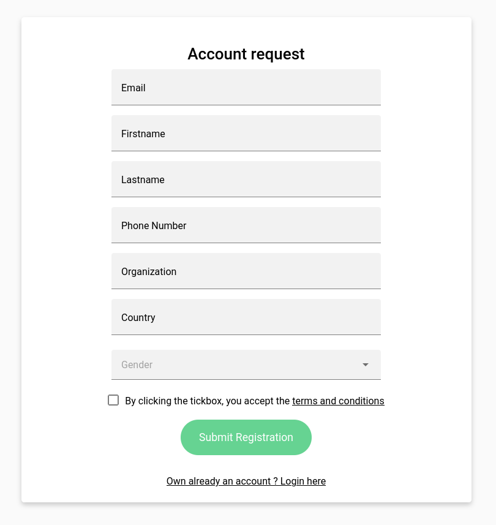
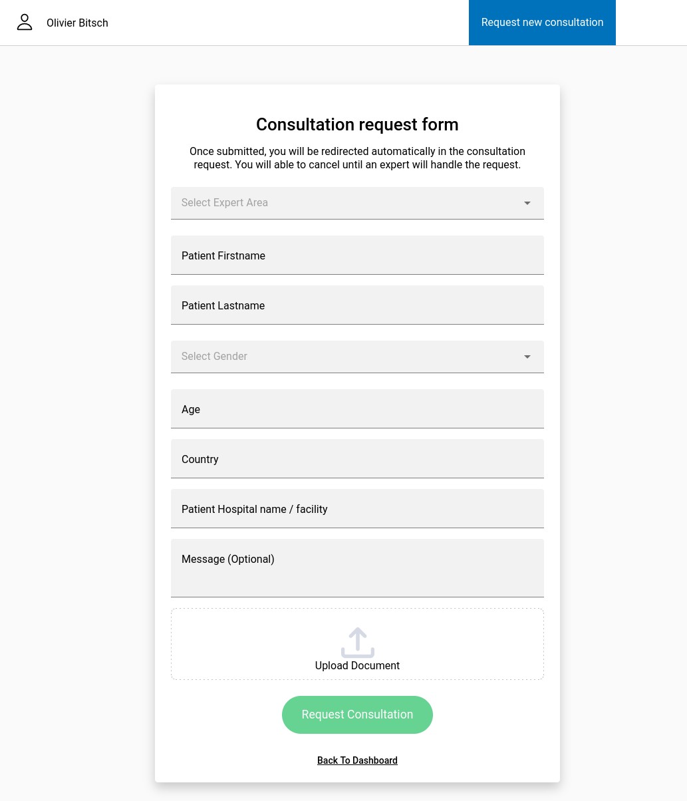
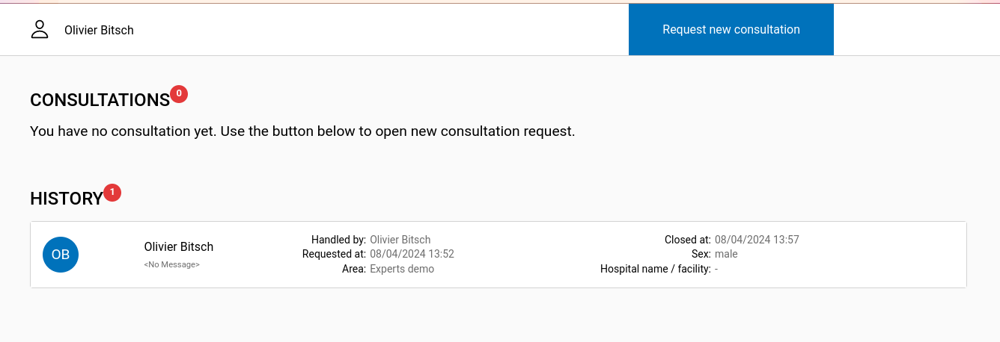

# Working with Partners

It's possible to delegate consultation request to partners (B2B model), whenever a nurse or a clinician need to talk with expert for specific cases.

## Account request

Partner must request account on a specific URL (you can have a look on [https://app.hcw-at-home.com/requester](https://app.hcw-at-home.com/requester)). They have to choose **No account ? Request account here** in order to have a registration form.

Upon the form validation, a HCW@Home admin must validate the user before he will be entitled to ask for new consultations in addition of create the user with same email in SSO platform.

## Request consultation

Once account has been added and approved, the Parner can click on **Institutional Connection** and login.

The partner has to click on **Request new consultation** and fill the patient's information.

Upon the form validation, all doctors in the select Area will be able to see the consultation request. Doctors might ensure to [Configure notification](configure-notification.md) in order do not miss a consultation request.

## Consultation history

According to the platform policy, once a consultation is closed, the consultation will stay visible only 24h.

